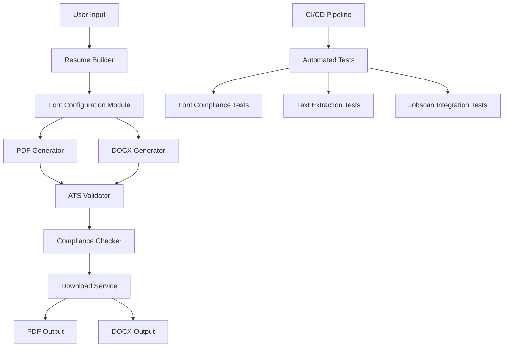

# Design Document: ATS Compliance Enhancement

## Overview

This design document outlines the technical architecture for implementing comprehensive ATS (Applicant Tracking System) compliance in the CV Generator. The solution addresses the critical issue where 90% of generated resumes fail ATS parsing due to Google Fonts CFF encoding problems in @react-pdf/renderer.

The design implements a three-phase approach:
1. **Phase 1**: Font System Overhaul - Replace Google Fonts with standard PDF fonts
2. **Phase 2**: Dual Format Export - Add DOCX generation alongside PDF
3. **Phase 3**: Automated Testing - Implement CI/CD compliance validation

**Success Metrics**: Achieve 85-95/100 Jobscan scores, 100% text extraction success, and 2-3x improvement in user interview rates.

## Architecture

### High-Level Architecture



### Component Architecture

The system is organized into several key modules:

1. **Font Management Layer**: Centralized font configuration and validation
2. **Generation Layer**: PDF and DOCX creation engines
3. **Validation Layer**: ATS compliance testing and scoring
4. **Testing Layer**: Automated compliance verification
5. **Monitoring Layer**: Performance and compatibility tracking

## Components and Interfaces

### Font Configuration Module

**Purpose**: Centralize font management and ensure ATS compatibility

```typescript
// fonts/defaultFonts.ts
export const STANDARD_FONTS = {
  HELVETICA: 'Helvetica',
  TIMES_ROMAN: 'Times-Roman',
  COURIER: 'Courier',
} as const;

export interface FontConfig {
  family: string;
  size: number;
  color: string;
}

export interface ResumeFont {
  heading: FontConfig;
  body: FontConfig;
  minor: FontConfig;
}

export function getResumeFont(variant: 'heading' | 'body' | 'minor'): FontConfig;
export function validateFontCompliance(config: FontConfig): boolean;
```

**Key Features**:
- Standard PDF font definitions (Helvetica, Times-Roman, Courier)
- Font validation to prevent non-ATS compatible fonts
- Centralized configuration for consistency
- Pure black (#000000) color enforcement

### PDF Generation Engine

**Purpose**: Generate ATS-compatible PDFs using standard fonts

```typescript
// export/pdfGenerator.ts
export class ATSPdfGenerator {
  static async generateResume(data: ResumeData): Promise<Buffer>;
  static validateFontUsage(document: PDFDocument): ValidationResult;
  static extractTextForValidation(pdf: Buffer): Promise<string>;
}

interface PDFGenerationConfig {
  fonts: ResumeFont;
  margins: MarginConfig;
  layout: LayoutConfig;
  validation: ValidationConfig;
}
```

**Key Features**:
- Standard font integration (no Google Fonts)
- Text extraction validation
- Single-column layout for ATS compatibility
- Consistent formatting and spacing

### DOCX Generation Engine

**Purpose**: Provide alternative format for maximum ATS compatibility

```typescript
// export/docxGenerator.ts
export class ATSDocxGenerator {
  static async generateResume(data: ResumeData): Promise<Buffer>;
  static validateContentConsistency(pdf: Buffer, docx: Buffer): Promise<boolean>;
}

interface DocxGenerationConfig {
  fonts: ResumeFont;
  formatting: FormattingConfig;
  structure: StructureConfig;
}
```

**Key Features**:
- Identical content to PDF version
- Standard font usage
- Native Word compatibility
- Content consistency validation

### ATS Validation Service

**Purpose**: Validate ATS compatibility and provide scoring

```typescript
// validation/atsValidator.ts
export class ATSValidator {
  static async validateTextExtraction(document: Buffer): Promise<TextExtractionResult>;
  static async getJobscanScore(document: Buffer): Promise<JobscanResult>;
  static async validateCopyPaste(document: Buffer): Promise<CopyPasteResult>;
  static async runComplianceCheck(document: Buffer): Promise<ComplianceReport>;
}

interface ComplianceReport {
  score: number;
  textExtractionSuccess: boolean;
  fontCompliance: boolean;
  structureCompliance: boolean;
  recommendations: string[];
}
```

**Key Features**:
- Real-time text extraction validation
- Jobscan integration for scoring
- Copy-paste test automation
- Comprehensive compliance reporting

### Download Service

**Purpose**: Provide dual-format downloads with validation

```typescript
// api/download.ts
export class DownloadService {
  static async generateAndValidate(data: ResumeData, format: 'pdf' | 'docx'): Promise<ValidatedDocument>;
  static async validateBeforeDownload(document: Buffer): Promise<ValidationResult>;
}

interface ValidatedDocument {
  buffer: Buffer;
  contentType: string;
  filename: string;
  validationReport: ComplianceReport;
}
```

## Data Models

### Resume Data Structure

```typescript
interface ResumeData {
  personalInfo: PersonalInfo;
  professionalSummary: string;
  experience: WorkExperience[];
  education: Education[];
  skills: SkillCategory[];
  certifications?: Certification[];
}

interface PersonalInfo {
  fullName: string;
  email: string;
  phone: string;
  location: string;
  linkedinUrl?: string;
}

interface WorkExperience {
  jobTitle: string;
  company: string;
  startDate: Date;
  endDate?: Date;
  achievements: string[];
  keywords: string[];
}
```

### Validation Models

```typescript
interface ValidationResult {
  isCompliant: boolean;
  score: number;
  issues: ValidationIssue[];
  timestamp: Date;
}

interface ValidationIssue {
  type: 'font' | 'structure' | 'content' | 'extraction';
  severity: 'error' | 'warning' | 'info';
  message: string;
  recommendation: string;
}

interface TextExtractionResult {
  success: boolean;
  extractedText: string;
  originalLength: number;
  extractedLength: number;
  hasGarbledChars: boolean;
  garbledPatterns: string[];
}
```

## Correctness Properties

*A property is a characteristic or behavior that should hold true across all valid executions of a system—essentially, a formal statement about what the system should do. Properties serve as the bridge between human-readable specifications and machine-verifiable correctness guarantees.*

### Converting EARS to Properties

Based on the prework analysis, I've identified the following testable properties from the acceptance criteria:

**Property 1: Standard Font Compliance**
*For any* generated PDF document, all text elements should use only standard PDF fonts (Helvetica, Times-Roman, or Courier) and contain no Google Font references
**Validates: Requirements 1.2, 2.1, 16.2**

**Property 2: DOCX Generation Success**
*For any* valid resume data, the system should successfully generate a DOCX file without errors
**Validates: Requirements 1.1**

**Property 3: Pure Black Text Color**
*For any* generated document, all text elements should use pure black color (#000000) for maximum ATS readability
**Validates: Requirements 2.6**

**Property 4: ATS Score Compliance**
*For any* generated document (PDF or DOCX), the Jobscan compatibility score should be ≥85/100
**Validates: Requirements 1.6, 18.5, 19.3**

**Property 5: Garbled Text Prevention**
*For any* generated document, text extraction should not contain garbled character patterns (îòðéðóð, etc.)
**Validates: Requirements 11.4, 17.2**

**Property 6: Complete Text Extraction**
*For any* generated document, 100% of the original text content should be extractable through standard PDF/DOCX text extraction methods
**Validates: Requirements 17.3**

**Property 7: Format Content Consistency**
*For any* resume data, the PDF and DOCX versions should contain identical text content when extracted
**Validates: Requirements 18.1, 18.4**

## Error Handling

### Font Loading Errors
- **Scenario**: Standard font not available on system
- **Handling**: Fallback to next available standard font in priority order
- **Recovery**: Log warning and continue with available font
- **User Impact**: Minimal - all standard fonts are widely supported

### DOCX Generation Failures
- **Scenario**: DOCX library encounters unsupported content
- **Handling**: Graceful degradation to PDF-only mode
- **Recovery**: Notify user and provide PDF alternative
- **User Impact**: User still gets ATS-compatible PDF format

### Text Extraction Validation Failures
- **Scenario**: Generated document fails text extraction test
- **Handling**: Prevent download and show validation errors
- **Recovery**: Regenerate with corrected configuration
- **User Impact**: Ensures user never downloads non-ATS compatible resume

### Jobscan API Failures
- **Scenario**: External Jobscan service unavailable
- **Handling**: Use local text extraction validation as fallback
- **Recovery**: Retry with exponential backoff
- **User Impact**: Reduced validation but core functionality maintained

### CI/CD Test Failures
- **Scenario**: Automated compliance tests fail
- **Handling**: Block deployment and alert development team
- **Recovery**: Fix compliance issues before deployment
- **User Impact**: Prevents regression from reaching users

## Testing Strategy

### Dual Testing Approach

The testing strategy employs both unit tests and property-based tests to ensure comprehensive coverage:

**Unit Tests**: Verify specific examples, edge cases, and error conditions
- Test specific font configurations work correctly
- Test DOCX generation with sample data
- Test error handling scenarios
- Test API integrations and edge cases

**Property-Based Tests**: Verify universal properties across all inputs
- Generate random resume data and validate font compliance
- Test text extraction across various content types
- Validate Jobscan scores across different resume structures
- Ensure content consistency between formats

### Property-Based Testing Configuration

**Testing Framework**: Jest with fast-check for property-based testing
**Minimum Iterations**: 100 per property test (due to randomization)
**Test Tagging**: Each property test references its design document property

**Example Test Tags**:
```typescript
// Feature: ats-compliance, Property 1: Standard Font Compliance
// Feature: ats-compliance, Property 4: ATS Score Compliance
// Feature: ats-compliance, Property 7: Format Content Consistency
```

### Test Categories

**Font Compliance Tests**:
- Validate only standard fonts are used
- Check font configuration consistency
- Test font fallback mechanisms
- Verify color compliance (#000000)

**Text Extraction Tests**:
- Validate 100% text extraction success
- Check for garbled character patterns
- Test copy-paste functionality
- Compare extracted vs original content

**Format Consistency Tests**:
- Compare PDF and DOCX content
- Validate identical text extraction
- Test formatting preservation
- Check metadata consistency

**ATS Scoring Tests**:
- Validate Jobscan scores ≥85/100
- Test score consistency across formats
- Validate scoring improvements
- Test score regression detection

**Integration Tests**:
- End-to-end resume generation workflow
- Dual format download functionality
- Validation pipeline integration
- Error handling and recovery

### Automated Testing Pipeline

**CI/CD Integration**:
```yaml
# .github/workflows/ats-compliance.yml
name: ATS Compliance Check
on: [push, pull_request]
jobs:
  ats-compliance:
    runs-on: ubuntu-latest
    steps:
      - name: Run font compliance tests
      - name: Run text extraction tests  
      - name: Run Jobscan validation tests
      - name: Run format consistency tests
      - name: Generate compliance report
```

**Test Execution**:
- All tests run on every commit
- Property tests run with 100+ iterations
- Integration tests validate full workflow
- Performance tests ensure no regression
- Compliance reports generated automatically

**Quality Gates**:
- All property tests must pass
- Jobscan scores must meet thresholds
- Text extraction must be 100% successful
- No garbled text patterns allowed
- Font compliance must be validated

This comprehensive testing strategy ensures that ATS compliance is maintained throughout development and prevents regressions that could impact user success rates.