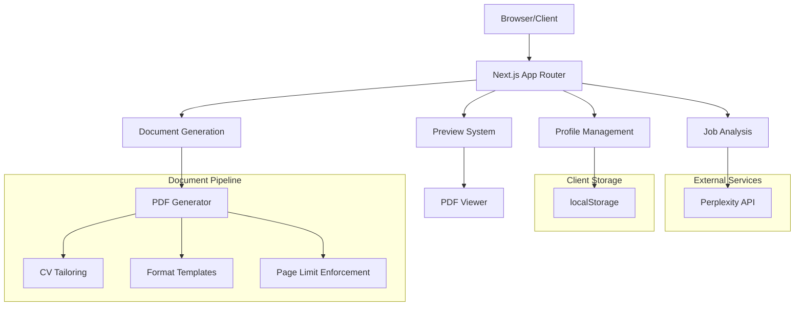

# Design Document: CV + Cover Letter Generator

## Overview

The CV and Cover Letter Generator is a Next.js web application that enables users to create tailored professional documents in German and English. The system follows a user-controlled generation workflow where users select which documents to create, preview them before downloading, and maintain strict page limits.

### Key Design Principles

1. **User Control**: Users explicitly select which documents to generate via checkboxes
2. **Privacy First**: All data stored in localStorage, no authentication required
3. **Quality Assurance**: Mandatory preview before download with strict page limits
4. **Format Compliance**: Exact matching of German professional document formats
5. **Performance**: Fast generation (<10s) with responsive design

## Architecture

### System Architecture



### Technology Stack

- **Frontend**: Next.js 15 (App Router), TypeScript 5.3+, React 18
- **Styling**: Tailwind CSS, shadcn/ui components
- **Forms**: React Hook Form with Zod validation
- **PDF Generation**: @react-pdf/renderer
- **Storage**: Browser localStorage
- **API**: Perplexity API for job analysis
- **Deployment**: Vercel

## Components and Interfaces

### Core Components

#### 1. Profile Management System
```typescript
interface UserProfile {
  header: {
    name: string;
    title: string;
    location: string;
    phone: string;
    email: string;
    linkedin: string;
    github: string;
  };
  summary: string;
  experience: ExperienceEntry[];
  education: EducationEntry[];
  skills: SkillCategory[];
  languages: LanguageEntry[];
  references: ReferenceEntry[];
}

interface ExperienceEntry {
  jobTitle: string;
  company: string;
  location: string;
  startDate: string;
  endDate: string;
  bullets: string[];
}
```

#### 2. Job Analysis System
```typescript
interface JobAnalysis {
  jobTitle: string;
  companyName: string;
  mustHaveKeywords: string[];
  preferredKeywords: string[];
  niceToHaveKeywords: string[];
  languageRequirement: 'German' | 'English' | 'Both';
}

interface KeywordScore {
  keyword: string;
  type: 'mustHave' | 'preferred' | 'niceToHave';
  matched: boolean;
}
```

#### 3. Document Generation System
```typescript
interface DocumentRequest {
  type: 'germanCV' | 'englishCV' | 'germanCoverLetter' | 'englishCoverLetter';
  profile: UserProfile;
  jobAnalysis: JobAnalysis;
  tailoredContent: TailoredContent;
}

interface TailoredContent {
  summary: string;
  topBullets: ScoredBullet[];
  reorderedSkills: SkillCategory[];
  matchScore: number;
}
```
### Page Structure and Navigation

#### Page Flow
```mermaid
graph LR
    A[/profile] --> B[/generate]
    B --> C[/results]
    C --> D[Preview Modal]
    D --> E[Download]
    
    A -.-> A1[localStorage Auto-save]
    B -.-> B1[Perplexity API]
    C -.-> C1[PDF Generation]
    D -.-> D1[PDF Viewer]
```

#### Component Hierarchy
```
App Layout
├── Navigation Header
├── Page Content
│   ├── ProfilePage
│   │   ├── ProfileForm
│   │   │   ├── HeaderSection
│   │   │   ├── SummarySection
│   │   │   ├── ExperienceSection
│   │   │   ├── EducationSection
│   │   │   ├── SkillsSection
│   │   │   ├── LanguagesSection
│   │   │   └── ReferencesSection
│   │   └── SaveIndicator
│   ├── GeneratePage
│   │   ├── JobDescriptionInput
│   │   ├── AnalysisResults
│   │   ├── DocumentSelection
│   │   └── GenerateButton
│   └── ResultsPage
│       ├── DocumentList
│       ├── PreviewModal
│       └── DownloadActions
└── Footer
```

## Data Models

### Profile Data Structure
```typescript
// Stored in localStorage as 'cv-generator-profile'
interface StoredProfile {
  version: string; // For future migrations
  lastUpdated: string;
  profile: UserProfile;
}

// Experience entry with categorized bullets
interface ExperienceEntry {
  id: string;
  jobTitle: string;
  subtitle?: string; // For German format: "Python-Entwicklung & Echtzeitsysteme"
  company: string;
  location: string;
  startDate: string; // MM/YYYY format
  endDate: string; // MM/YYYY or "Heute"/"Present"
  bullets: CategorizedBullet[];
}

interface CategorizedBullet {
  id: string;
  categoryLabel: string; // e.g., "Python-Anwendungsentwicklung"
  description: string; // Achievement text
  keywords?: string[]; // For scoring
  score?: number; // Calculated during tailoring
}

// Skills organized by thematic categories
interface SkillCategory {
  id: string;
  name: string; // e.g., "Python-Entwicklung", "DevOps & Tools"
  skills: Skill[];
  relevanceScore?: number; // For reordering
}

interface Skill {
  name: string;
  description: string;
  keywords: string[];
}
```

### Document Generation Pipeline
```typescript
interface GenerationPipeline {
  input: {
    profile: UserProfile;
    jobAnalysis: JobAnalysis;
    selectedDocuments: DocumentType[];
  };
  processing: {
    tailoring: CVTailoringResult;
    formatting: DocumentFormat[];
    pageLimitEnforcement: PageLimitResult;
  };
  output: {
    documents: GeneratedDocument[];
    warnings: string[];
  };
}

interface CVTailoringResult {
  originalBulletCount: number;
  finalBulletCount: number;
  removedExperiences: string[];
  rewrittenSummary: string;
  reorderedSkills: SkillCategory[];
  matchScore: number;
  matchedKeywords: KeywordScore[];
}
```

### Perplexity API Integration

```typescript
interface PerplexityRequest {
  model: 'llama-3.1-sonar-large-128k-online';
  messages: Array<{
    role: 'system' | 'user';
    content: string;
  }>;
  temperature: 0.2;
  max_tokens: 2000;
}

async function analyzeJobWithPerplexity(
  jobDescription: string
): Promise<JobAnalysis> {
  const prompt = `Analyze this job description and extract key information.

Job Description: ${jobDescription}

Output ONLY valid JSON in this structure:
{
  "jobTitle": "exact job title",
  "companyName": "company name (if mentioned)",
  "mustHaveKeywords": ["5-10 critical keywords"],
  "preferredKeywords": ["5-10 important keywords"],
  "niceToHaveKeywords": ["3-8 bonus keywords"],
  "languageRequirement": "German" or "English" or "Both"
}

Prioritize keywords that appear 3+ times or are emphasized.`;

  const response = await fetch('https://api.perplexity.ai/chat/completions', {
    method: 'POST',
    headers: {
      'Authorization': `Bearer ${process.env.PERPLEXITY_API_KEY}`,
      'Content-Type': 'application/json'
    },
    body: JSON.stringify({
      model: 'llama-3.1-sonar-large-128k-online',
      messages: [
        {
          role: 'system',
          content: 'You are an expert HR analyst. Always respond with valid JSON only.'
        },
        {
          role: 'user',
          content: prompt
        }
      ],
      temperature: 0.2,
      max_tokens: 2000
    })
  });

  if (!response.ok) {
    throw new Error(`Perplexity API error: ${response.status}`);
  }

  const data = await response.json();
  const content = data.choices[0].message.content;

  // Clean markdown fences
  const cleaned = content
    .replace(/```json\n?/g, '')
    .replace(/```\n?/g, '')
    .trim();

  return JSON.parse(cleaned);
}
```

### Rate Limiting for API Calls

```typescript
class RateLimiter {
  private queue: Array<() => Promise<any>> = [];
  private processing = false;
  private lastCallTime = 0;
  private minInterval = 1000; // 1 second between calls

  async callAPI<T>(apiCall: () => Promise<T>): Promise<T> {
    return new Promise((resolve, reject) => {
      this.queue.push(async () => {
        try {
          const now = Date.now();
          const timeSinceLastCall = now - this.lastCallTime;
          
          if (timeSinceLastCall < this.minInterval) {
            await new Promise(r => setTimeout(r, this.minInterval - timeSinceLastCall));
          }
          
          this.lastCallTime = Date.now();
          const result = await apiCall();
          resolve(result);
        } catch (error) {
          reject(error);
        }
      });
      
      this.processQueue();
    });
  }

  private async processQueue() {
    if (this.processing || this.queue.length === 0) return;
    
    this.processing = true;
    while (this.queue.length > 0) {
      const call = this.queue.shift();
      await call();
    }
    this.processing = false;
  }
}
```

## CV Tailoring Algorithm

### Summary Rewriting Implementation

```typescript
async function rewriteSummary(
  originalSummary: string,
  topKeywords: string[],
  jobTitle: string,
  company: string
): Promise<string> {
  const prompt = `Rewrite this professional profile summary to emphasize specific keywords while maintaining the original tone and achievements.

Original Summary: ${originalSummary}

Keywords to emphasize (incorporate naturally): ${topKeywords.join(', ')}

Target Job: ${jobTitle} at ${company}

Requirements:
- Keep 3-4 sentences (80-120 words)
- Maintain professional tone and first-person perspective
- Naturally incorporate top keywords
- Keep specific metrics and achievements
- Mention target role and company
- Use active voice and strong verbs

Output only the rewritten summary, no explanations.`;

  const response = await fetch('https://api.perplexity.ai/chat/completions', {
    method: 'POST',
    headers: {
      'Authorization': `Bearer ${process.env.PERPLEXITY_API_KEY}`,
      'Content-Type': 'application/json'
    },
    body: JSON.stringify({
      model: 'llama-3.1-sonar-large-128k-online',
      messages: [{ role: 'user', content: prompt }],
      temperature: 0.3,
      max_tokens: 500
    })
  });

  const data = await response.json();
  return data.choices[0].message.content.trim();
}
```

### Skills Reordering Algorithm

```typescript
function reorderSkillsByRelevance(
  skills: SkillCategory[],
  jobAnalysis: JobAnalysis
): SkillCategory[] {
  const allKeywords = [
    ...jobAnalysis.mustHaveKeywords,
    ...jobAnalysis.preferredKeywords,
    ...jobAnalysis.niceToHaveKeywords
  ];

  // Score each skill category
  const scoredCategories = skills.map(category => {
    let score = 0;
    
    // Check category name
    allKeywords.forEach(keyword => {
      if (category.name.toLowerCase().includes(keyword.toLowerCase())) {
        score += 5;
      }
    });
    
    // Check individual skills
    category.skills.forEach(skill => {
      allKeywords.forEach(keyword => {
        if (skill.name.toLowerCase().includes(keyword.toLowerCase()) ||
            skill.description.toLowerCase().includes(keyword.toLowerCase())) {
          score += 2;
        }
      });
    });
    
    return {
      ...category,
      relevanceScore: score
    };
  });

  // Sort by score (highest first)
  return scoredCategories.sort((a, b) => b.relevanceScore - a.relevanceScore);
}
```

### Match Score Calculation

```typescript
function calculateMatchScore(
  selectedBullets: CategorizedBullet[],
  reorderedSkills: SkillCategory[],
  jobAnalysis: JobAnalysis
): number {
  const allKeywords = [
    ...jobAnalysis.mustHaveKeywords,
    ...jobAnalysis.preferredKeywords,
    ...jobAnalysis.niceToHaveKeywords
  ];

  const matchedKeywords = new Set<string>();

  // Check bullets
  selectedBullets.forEach(bullet => {
    allKeywords.forEach(keyword => {
      if (bullet.description.toLowerCase().includes(keyword.toLowerCase())) {
        matchedKeywords.add(keyword);
      }
    });
  });

  // Check skills
  reorderedSkills.forEach(category => {
    category.skills.forEach(skill => {
      allKeywords.forEach(keyword => {
        if (skill.name.toLowerCase().includes(keyword.toLowerCase()) ||
            skill.description.toLowerCase().includes(keyword.toLowerCase())) {
          matchedKeywords.add(keyword);
        }
      });
    });
  });

  // Calculate percentage
  const matchScore = Math.round(
    (matchedKeywords.size / allKeywords.length) * 100
  );

  return matchScore;
}
```

### Utility Functions

```typescript
// Group array by key
function groupBy<T>(array: T[], key: keyof T): Record<string, T[]> {
  return array.reduce((groups, item) => {
    const groupKey = String(item[key]);
    if (!groups[groupKey]) {
      groups[groupKey] = [];
    }
    groups[groupKey].push(item);
    return groups;
  }, {} as Record<string, T[]>);
}

// Extract top keywords from job analysis
function extractTopKeywords(jobAnalysis: JobAnalysis, count: number): string[] {
  const weightedKeywords = [
    ...jobAnalysis.mustHaveKeywords.map(kw => ({ keyword: kw, weight: 3 })),
    ...jobAnalysis.preferredKeywords.map(kw => ({ keyword: kw, weight: 2 })),
    ...jobAnalysis.niceToHaveKeywords.map(kw => ({ keyword: kw, weight: 1 }))
  ];

  return weightedKeywords
    .sort((a, b) => b.weight - a.weight)
    .slice(0, count)
    .map(item => item.keyword);
}

// Hash string for caching
function hashString(str: string): string {
  let hash = 0;
  for (let i = 0; i < str.length; i++) {
    const char = str.charCodeAt(i);
    hash = ((hash << 5) - hash) + char;
    hash = hash & hash; // Convert to 32-bit integer
  }
  return hash.toString();
}
```
```typescript
function calculateBulletScore(
  bullet: CategorizedBullet,
  jobAnalysis: JobAnalysis
): number {
  let score = 0;
  const content = bullet.content.toLowerCase();
  
  // Must-have keywords: +10 points each
  jobAnalysis.mustHaveKeywords.forEach(keyword => {
    if (content.includes(keyword.toLowerCase())) {
      score += 10;
    }
  });
  
  // Preferred keywords: +5 points each
  jobAnalysis.preferredKeywords.forEach(keyword => {
    if (content.includes(keyword.toLowerCase())) {
      score += 5;
    }
  });
  
  // Nice-to-have keywords: +2 points each
  jobAnalysis.niceToHaveKeywords.forEach(keyword => {
    if (content.includes(keyword.toLowerCase())) {
      score += 2;
    }
  });
  
  return score;
}
```

### Keyword Scoring System
```typescript
function calculateBulletScore(
  bullet: CategorizedBullet,
  jobAnalysis: JobAnalysis
): number {
  let score = 0;
  const content = bullet.description.toLowerCase();
  
  // Must-have keywords: +10 points each
  jobAnalysis.mustHaveKeywords.forEach(keyword => {
    if (content.includes(keyword.toLowerCase())) {
      score += 10;
    }
  });
  
  // Preferred keywords: +5 points each
  jobAnalysis.preferredKeywords.forEach(keyword => {
    if (content.includes(keyword.toLowerCase())) {
      score += 5;
    }
  });
  
  // Nice-to-have keywords: +2 points each
  jobAnalysis.niceToHaveKeywords.forEach(keyword => {
    if (content.includes(keyword.toLowerCase())) {
      score += 2;
    }
  });
  
  return score;
}
```
```typescript
function tailorCVContent(
  profile: UserProfile,
  jobAnalysis: JobAnalysis
): TailoredContent {
  // Step 1: Score all bullets
  const scoredBullets = profile.experience.flatMap(exp =>
    exp.bullets.map(bullet => ({
      ...bullet,
      experienceId: exp.id,
      score: calculateBulletScore(bullet, jobAnalysis)
    }))
  );
  
  // Step 2: Sort by score and group by experience
  const bulletsByExperience = groupBy(scoredBullets, 'experienceId');
  
  // Step 3: Select top 6-8 bullets per experience
  const selectedBullets = Object.entries(bulletsByExperience).map(
    ([expId, bullets]) => ({
      experienceId: expId,
      bullets: bullets
        .sort((a, b) => b.score - a.score)
        .slice(0, 8) // Start with 8, reduce if needed for page limits
    })
  );
  
  // Step 4: Rewrite summary with top keywords
  const topKeywords = extractTopKeywords(jobAnalysis, 5);
  const rewrittenSummary = rewriteSummary(profile.summary, topKeywords);
  
  // Step 5: Reorder skills by relevance
  const reorderedSkills = reorderSkillsByRelevance(
    profile.skills,
    jobAnalysis
  );
  
  // Step 6: Calculate match score
  const matchScore = calculateMatchScore(
    selectedBullets,
    reorderedSkills,
    jobAnalysis
  );
  
  return {
    summary: rewrittenSummary,
    topBullets: selectedBullets.flatMap(exp => exp.bullets),
    reorderedSkills,
    matchScore
  };
}
```

### Content Selection Algorithm
```typescript
function tailorCVContent(
  profile: UserProfile,
  jobAnalysis: JobAnalysis
): TailoredContent {
  // Step 1: Score all bullets
  const scoredBullets = profile.experience.flatMap(exp =>
    exp.bullets.map(bullet => ({
      ...bullet,
      experienceId: exp.id,
      score: calculateBulletScore(bullet, jobAnalysis)
    }))
  );
  
  // Step 2: Sort by score and group by experience
  const bulletsByExperience = groupBy(scoredBullets, 'experienceId');
  
  // Step 3: Select top 6-8 bullets per experience
  const selectedBullets = Object.entries(bulletsByExperience).map(
    ([expId, bullets]) => ({
      experienceId: expId,
      bullets: bullets
        .sort((a, b) => b.score - a.score)
        .slice(0, 8) // Start with 8, reduce if needed for page limits
    })
  );
  
  // Step 4: Rewrite summary with top keywords
  const topKeywords = extractTopKeywords(jobAnalysis, 5);
  const rewrittenSummary = rewriteSummary(
    profile.summary, 
    topKeywords, 
    jobAnalysis.jobTitle, 
    jobAnalysis.companyName
  );
  
  // Step 5: Reorder skills by relevance
  const reorderedSkills = reorderSkillsByRelevance(
    profile.skills,
    jobAnalysis
  );
  
  // Step 6: Calculate match score
  const matchScore = calculateMatchScore(
    selectedBullets.flatMap(exp => exp.bullets),
    reorderedSkills,
    jobAnalysis
  );
  
  return {
    summary: rewrittenSummary,
    topBullets: selectedBullets.flatMap(exp => exp.bullets),
    reorderedSkills,
    matchScore
  };
}
```

## Page Limit Enforcement

### Exact Page Calculation System

```typescript
import { pdf } from '@react-pdf/renderer';
import { PDFDocument } from 'pdf-lib';

// Actual page calculation using @react-pdf/renderer
async function getActualPageCount(pdfDocument: React.ReactElement): Promise<number> {
  // Render PDF to get actual page count
  const blob = await pdf(pdfDocument).toBlob();
  
  // Use pdf-lib to count pages
  const pdfDoc = await PDFDocument.load(await blob.arrayBuffer());
  return pdfDoc.getPageCount();
}
```
```typescript
function enforceCVPageLimit(
  document: CVDocument,
  maxPages: number = 2
): PageLimitResult {
  let currentPages = calculatePageCount(document);
  const warnings: string[] = [];
  
  if (currentPages <= maxPages) {
    return { document, warnings, pagesReduced: false };
  }
  
  // Step 1: Reduce bullets to 6 per experience
  if (currentPages > maxPages) {
    document = reduceBulletsPerExperience(document, 6);
    currentPages = calculatePageCount(document);
    warnings.push("Reduced experience bullets to 6 per position");
  }
  
  // Step 2: Reduce bullets to 5 per experience
  if (currentPages > maxPages) {
    document = reduceBulletsPerExperience(document, 5);
    currentPages = calculatePageCount(document);
    warnings.push("Reduced experience bullets to 5 per position");
  }
  
  // Step 3: Remove oldest experience entries
  while (currentPages > maxPages && document.experience.length > 2) {
    const removedExp = document.experience.pop();
    currentPages = calculatePageCount(document);
    warnings.push(`Removed experience: ${removedExp.jobTitle} at ${removedExp.company}`);
  }
  
  // Step 4: Final check - should never exceed 2 pages
  if (currentPages > maxPages) {
    throw new Error("Unable to fit CV content within 2 pages");
  }
  
  return {
    document,
    warnings,
    pagesReduced: warnings.length > 0
  };
}
```

### CV Page Limit Algorithm (2 Pages Maximum)
```typescript
async function enforceCVPageLimit(
  document: CVDocument,
  maxPages: number = 2
): Promise<PageLimitResult> {
  // Render to get actual page count
  const pdfElement = <GermanCVPDF profile={document.profile} tailoredContent={document.content} />;
  let currentPages = await getActualPageCount(pdfElement);
  const warnings: string[] = [];
  
  if (currentPages <= maxPages) {
    return { document, warnings, pagesReduced: false };
  }
  
  // Step 1: Reduce bullets to 6 per experience
  if (currentPages > maxPages) {
    document = reduceBulletsPerExperience(document, 6);
    const updatedPDF = <GermanCVPDF profile={document.profile} tailoredContent={document.content} />;
    currentPages = await getActualPageCount(updatedPDF);
    warnings.push("Reduced experience bullets to 6 per position");
  }
  
  // Step 2: Reduce bullets to 5 per experience
  if (currentPages > maxPages) {
    document = reduceBulletsPerExperience(document, 5);
    const updatedPDF = <GermanCVPDF profile={document.profile} tailoredContent={document.content} />;
    currentPages = await getActualPageCount(updatedPDF);
    warnings.push("Reduced experience bullets to 5 per position");
  }
  
  // Step 3: Remove oldest experience entries
  while (currentPages > maxPages && document.experience.length > 2) {
    const removedExp = document.experience.pop();
    const updatedPDF = <GermanCVPDF profile={document.profile} tailoredContent={document.content} />;
    currentPages = await getActualPageCount(updatedPDF);
    warnings.push(`Removed experience: ${removedExp.jobTitle} at ${removedExp.company}`);
  }
  
  // Step 4: Final fallback - aggressively trim content
  if (currentPages > maxPages) {
    document = {
      ...document,
      experience: document.experience.slice(0, 2).map(exp => ({
        ...exp,
        bullets: exp.bullets.slice(0, 4) // Only 4 bullets per experience
      })),
      skills: document.skills.slice(0, 3) // Only 3 skill categories
    };
    
    const finalPDF = <GermanCVPDF profile={document.profile} tailoredContent={document.content} />;
    currentPages = await getActualPageCount(finalPDF);
    
    if (currentPages > maxPages) {
      // Extreme case: remove all but most recent experience
      document = {
        ...document,
        experience: [document.experience[0]]
      };
    }
    
    warnings.push("Content was significantly reduced to fit 2 pages. Consider removing older experiences from your profile.");
  }
  
  return {
    document,
    warnings,
    pagesReduced: warnings.length > 0
  };
}

function reduceBulletsPerExperience(document: CVDocument, maxBullets: number): CVDocument {
  return {
    ...document,
    experience: document.experience.map(exp => ({
      ...exp,
      bullets: exp.bullets.slice(0, maxBullets)
    }))
  };
}
```
```typescript
function enforceCoverLetterPageLimit(
  document: CoverLetterDocument
): PageLimitResult {
  let currentPages = calculatePageCount(document);
  const warnings: string[] = [];
  
  if (currentPages <= 1) {
    return { document, warnings, pagesReduced: false };
  }
  
  // Step 1: Reduce line spacing from 1.15 to 1.0
  document.formatting.lineSpacing = 1.0;
  currentPages = calculatePageCount(document);
  
  if (currentPages <= 1) {
    warnings.push("Reduced line spacing to fit content");
    return { document, warnings, pagesReduced: true };
  }
  
  // Step 2: Reduce font size from 11pt to 10pt (minimum)
  document.formatting.fontSize = Math.max(10, document.formatting.fontSize - 1);
  currentPages = calculatePageCount(document);
  
  if (currentPages <= 1) {
    warnings.push("Reduced font size to fit content");
    return { document, warnings, pagesReduced: true };
  }
  
  // Step 3: Trim content (last resort)
  document = trimCoverLetterContent(document);
  warnings.push("Content was trimmed to fit one page");
  
  return { document, warnings, pagesReduced: true };
}
```
### Cover Letter Page Limit Algorithm (1 Page Maximum)
```typescript
async function enforceCoverLetterPageLimit(
  document: CoverLetterDocument
): Promise<PageLimitResult> {
  const pdfElement = <GermanCoverLetterPDF document={document} />;
  let currentPages = await getActualPageCount(pdfElement);
  const warnings: string[] = [];
  
  if (currentPages <= 1) {
    return { document, warnings, pagesReduced: false };
  }
  
  // Step 1: Reduce line spacing from 1.15 to 1.0
  document.formatting.lineSpacing = 1.0;
  const updatedPDF1 = <GermanCoverLetterPDF document={document} />;
  currentPages = await getActualPageCount(updatedPDF1);
  
  if (currentPages <= 1) {
    warnings.push("Reduced line spacing to fit content");
    return { document, warnings, pagesReduced: true };
  }
  
  // Step 2: Reduce font size from 11pt to 10pt (minimum)
  document.formatting.fontSize = Math.max(10, document.formatting.fontSize - 1);
  const updatedPDF2 = <GermanCoverLetterPDF document={document} />;
  currentPages = await getActualPageCount(updatedPDF2);
  
  if (currentPages <= 1) {
    warnings.push("Reduced font size to fit content");
    return { document, warnings, pagesReduced: true };
  }
  
  // Step 3: Trim content (last resort)
  document = trimCoverLetterContent(document);
  warnings.push("Content was trimmed to fit one page");
  
  return { document, warnings, pagesReduced: true };
}

function trimCoverLetterContent(document: CoverLetterDocument): CoverLetterDocument {
  // Trim each paragraph by 10-15% while maintaining meaning
  const trimParagraph = (text: string, maxReduction: number = 0.15): string => {
    const sentences = text.split('. ');
    const targetLength = Math.ceil(sentences.length * (1 - maxReduction));
    return sentences.slice(0, targetLength).join('. ') + (targetLength < sentences.length ? '.' : '');
  };

  return {
    ...document,
    content: {
      ...document.content,
      paragraphs: {
        opening: trimParagraph(document.content.paragraphs.opening, 0.1),
        technicalAchievements: trimParagraph(document.content.paragraphs.technicalAchievements, 0.15),
        domainExpertise: trimParagraph(document.content.paragraphs.domainExpertise, 0.15),
        technicalQualifications: trimParagraph(document.content.paragraphs.technicalQualifications, 0.1),
        closing: trimParagraph(document.content.paragraphs.closing, 0.1)
      }
    }
  };
}
```

### German CV Template Structure
```typescript
interface GermanCVTemplate {
  header: {
    name: { fontSize: 18, fontWeight: 'bold' };
    title: { fontSize: 12, style: 'italic' };
    contact: { fontSize: 10, separator: ' • ' };
  };
  sections: {
    profil: {
      title: 'PROFIL';
      content: string; // 3-4 sentences, 80-120 words
    };
    berufserfahrung: {
      title: 'BERUFSERFAHRUNG';
      entries: GermanExperienceEntry[];
    };
    ausbildung: {
      title: 'AUSBILDUNG';
      entries: EducationEntry[];
    };
    technischeFaehigkeiten: {
      title: 'TECHNISCHE FÄHIGKEITEN & KOMPETENZEN';
      categories: SkillCategory[];
    };
    sprachkenntnisse: {
      title: 'SPRACHKENNTNISSE';
      languages: LanguageEntry[];
    };
    referenzen: {
      title: 'REFERENZEN';
      contacts: ReferenceEntry[];
    };
  };
  formatting: {
    font: 'Helvetica' | 'Arial';
    bodyFontSize: 10 | 11;
    margins: { top: 0.5, bottom: 0.5, left: 0.5, right: 0.5 }; // inches
    lineSpacing: 1.0 | 1.15;
  };
}

interface GermanExperienceEntry {
  jobTitle: string;
  subtitle?: string; // e.g., "Python-Entwicklung & Echtzeitsysteme"
  company: string;
  location: string;
  period: string; // "MM/YYYY – MM/YYYY" or "MM/YYYY – Heute"
  bullets: CategorizedBullet[];
}
```

## German Content Generation

### Cover Letter Generation Logic

```typescript
async function generateCoverLetter(
  profile: UserProfile,
  jobAnalysis: JobAnalysis,
  tailoredContent: TailoredContent,
  language: 'German' | 'English'
): Promise<string> {
  const prompt = `Generate a professional ${language} cover letter.

Job: ${jobAnalysis.jobTitle} at ${jobAnalysis.companyName}
Top Keywords: ${jobAnalysis.mustHaveKeywords.slice(0, 5).join(', ')}

Profile Summary: ${tailoredContent.summary}

Top Achievements: ${tailoredContent.topBullets.slice(0, 4).map(b => `- ${b.categoryLabel}: ${b.description}`).join('\n')}

Requirements:
- ${language === 'German' ? 'Formal German (Sie form), "Sehr geehrte Damen und Herren," opening, "Mit freundlichen Grüßen" closing' : 'Professional English, "Dear Hiring Manager," opening, "Best regards," closing'}
- 400-500 words total (strict)
- 5 paragraphs: Opening, Technical Achievements, Domain Expertise, Technical Qualifications, Closing
- Incorporate top keywords naturally
- Reference specific achievements with metrics
- Show enthusiasm for company mission
- Mention availability and location

Output only the cover letter body (no headers), starting with the salutation.`;

  const response = await fetch('https://api.perplexity.ai/chat/completions', {
    method: 'POST',
    headers: {
      'Authorization': `Bearer ${process.env.PERPLEXITY_API_KEY}`,
      'Content-Type': 'application/json'
    },
    body: JSON.stringify({
      model: 'llama-3.1-sonar-large-128k-online',
      messages: [{ role: 'user', content: prompt }],
      temperature: 0.4, // Slightly higher for creative writing
      max_tokens: 2000
    })
  });

  const data = await response.json();
  return data.choices[0].message.content.trim();
}
```

### German Translation Logic

```typescript
async function generateGermanContent(
  englishContent: TailoredContent,
  profile: UserProfile,
  jobAnalysis: JobAnalysis
): Promise<TailoredContent> {
  // If profile is already in German, use directly
  if (isGerman(profile.summary)) {
    return englishContent;
  }

  // Otherwise, use Perplexity to translate summary
  const germanSummary = await translateWithPerplexity(
    englishContent.summary,
    'German',
    'professional business language (Sie form)'
  );

  return {
    ...englishContent,
    summary: germanSummary
  };
}

async function translateWithPerplexity(
  text: string,
  targetLanguage: 'German' | 'English',
  style: string
): Promise<string> {
  const prompt = `Translate this professional CV/cover letter text to ${targetLanguage}.

Text: ${text}

Requirements:
- Use ${targetLanguage === 'German' ? 'formal German business language (Sie form)' : 'professional English'}
- Keep technical terms in original language where standard (e.g., Python, Docker, API)
- Maintain metrics and numbers exactly
- ${style}

Output only the translated text, no explanations.`;

  const response = await fetch('https://api.perplexity.ai/chat/completions', {
    method: 'POST',
    headers: {
      'Authorization': `Bearer ${process.env.PERPLEXITY_API_KEY}`,
      'Content-Type': 'application/json'
    },
    body: JSON.stringify({
      model: 'llama-3.1-sonar-large-128k-online',
      messages: [{ role: 'user', content: prompt }],
      temperature: 0.2,
      max_tokens: 3000
    })
  });

  const data = await response.json();
  return data.choices[0].message.content.trim();
}

function isGerman(text: string): boolean {
  // Simple heuristic to detect German text
  const germanWords = ['und', 'der', 'die', 'das', 'ich', 'mit', 'für', 'von', 'zu', 'auf'];
  const words = text.toLowerCase().split(/\s+/);
  const germanWordCount = words.filter(word => germanWords.includes(word)).length;
  return germanWordCount / words.length > 0.1; // 10% threshold
}
```

## Document Format Templates
```typescript
interface GermanCoverLetterTemplate {
  header: {
    applicant: {
      name: string;
      title: string;
      location: string;
      contact: string; // "Phone | Email | LinkedIn | GitHub"
    };
    recipient: {
      company: string;
      department?: string;
      location: string;
    };
    date: string; // "Berlin, 9. Januar 2026"
    subject: string; // "Bewerbung als [Job Title]"
  };
  content: {
    salutation: 'Sehr geehrte Damen und Herren,';
    paragraphs: {
      opening: string; // 3-4 sentences
      technicalAchievements: string; // 4-5 sentences
      domainExpertise: string; // 4-5 sentences
      technicalQualifications: string; // 3-4 sentences
      closing: string; // 3-4 sentences
    };
    signature: {
      closing: 'Mit freundlichen Grüßen';
      name: string;
    };
  };
  constraints: {
    maxWords: 500;
    targetWords: 450;
    maxPages: 1;
  };
}
```

### German Cover Letter Template Structure
```typescript
interface GermanCoverLetterTemplate {
  header: {
    applicant: {
      name: string;
      title: string;
      location: string;
      contact: string; // "Phone | Email | LinkedIn | GitHub"
    };
    recipient: {
      company: string;
      department?: string;
      location: string;
    };
    date: string; // "Berlin, 9. Januar 2026"
    subject: string; // "Bewerbung als [Job Title]"
  };
  content: {
    salutation: 'Sehr geehrte Damen und Herren,';
    paragraphs: {
      intro: string; // Opening paragraph (3-4 sentences)
      body: string[]; // 3 body paragraphs [technical, domain, qualifications]
      conclusion: string; // Closing paragraph (3-4 sentences)
    };
    signature: {
      closing: 'Mit freundlichen Grüßen';
      name: string;
    };
  };
  constraints: {
    maxWords: 500;
    targetWords: 450;
    maxPages: 1;
  };
}
```
```typescript
// English CV uses same structure as German but with translated headers
interface EnglishCVTemplate extends Omit<GermanCVTemplate, 'sections'> {
  sections: {
    profile: { title: 'PROFILE' };
    professionalExperience: { title: 'PROFESSIONAL EXPERIENCE' };
    education: { title: 'EDUCATION' };
    technicalSkills: { title: 'TECHNICAL SKILLS & COMPETENCIES' };
    languages: { title: 'LANGUAGES' };
    references: { title: 'REFERENCES' };
  };
}

// English Cover Letter with business format
interface EnglishCoverLetterTemplate {
  header: {
    date: string; // "Berlin, January 9, 2026"
    subject: string; // "Application for [Job Title]" or "Re: [Job Title] Position"
  };
  content: {
    salutation: 'Dear Hiring Manager,';
    paragraphs: {
      opening: string;
      technicalAchievements: string;
      domainExpertise: string;
      technicalQualifications: string;
      closing: string;
    };
    signature: {
      closing: 'Best regards,' | 'Sincerely,';
      name: string;
    };
  };
}
```

### English Document Templates
```typescript
// English CV uses same structure as German but with translated headers
interface EnglishCVTemplate extends Omit<GermanCVTemplate, 'sections'> {
  sections: {
    profile: { title: 'PROFILE' };
    professionalExperience: { title: 'PROFESSIONAL EXPERIENCE' };
    education: { title: 'EDUCATION' };
    technicalSkills: { title: 'TECHNICAL SKILLS & COMPETENCIES' };
    languages: { title: 'LANGUAGES' };
    references: { title: 'REFERENCES' };
  };
}

// English Cover Letter with business format
interface EnglishCoverLetterTemplate {
  header: {
    date: string; // "Berlin, January 9, 2026"
    subject: string; // "Application for [Job Title]" or "Re: [Job Title] Position"
  };
  content: {
    salutation: 'Dear Hiring Manager,';
    paragraphs: {
      intro: string;
      body: string[]; // 3 body paragraphs
      conclusion: string;
    };
    signature: {
      closing: 'Best regards,' | 'Sincerely,';
      name: string;
    };
  };
}
```

## Download and File Management

### ZIP File Generation

```typescript
import JSZip from 'jszip';

async function generateZipFile(
  documents: GeneratedDocument[],
  company: string
): Promise<Blob> {
  const zip = new JSZip();

  // Add each document to ZIP
  for (const doc of documents) {
    const filename = generateFilename(doc.type, company);
    zip.file(filename, doc.pdfBlob);
  }

  // Generate ZIP
  const zipBlob = await zip.generateAsync({ type: 'blob' });
  return zipBlob;
}

function generateFilename(
  type: DocumentType,
  company: string
): string {
  const date = new Date().toISOString().split('T')[0]; // YYYY-MM-DD
  const companyName = company || 'Company';

  const prefixes = {
    germanCV: 'Lebenslauf',
    englishCV: 'Resume',
    germanCoverLetter: 'Anschreiben',
    englishCoverLetter: 'CoverLetter'
  };

  return `${prefixes[type]}_Niranjan_Thimmappa_${companyName}_${date}.pdf`;
}
```

## Mobile Interface Components

### Swipe Gesture Support for PDF Preview

```typescript
import { useSwipeable } from 'react-swipeable';

function PreviewModal({ document }: { document: GeneratedDocument }) {
  const [currentPage, setCurrentPage] = useState(1);
  const totalPages = document.pageCount;

  const handlers = useSwipeable({
    onSwipedLeft: () => {
      if (currentPage < totalPages) {
        setCurrentPage(prev => prev + 1);
      }
    },
    onSwipedRight: () => {
      if (currentPage > 1) {
        setCurrentPage(prev => prev - 1);
      }
    },
    preventScrollOnSwipe: true,
    trackMouse: false // Only touch gestures
  });

  return (
    <div {...handlers} className="preview-container">
      <PDFViewer document={document} currentPage={currentPage} />
      <div className="page-navigation">
        <button 
          onClick={() => setCurrentPage(prev => Math.max(1, prev - 1))}
          disabled={currentPage === 1}
        >
          ← Previous
        </button>
        <span>Page {currentPage} of {totalPages}</span>
        <button 
          onClick={() => setCurrentPage(prev => Math.min(totalPages, prev + 1))}
          disabled={currentPage === totalPages}
        >
          Next →
        </button>
      </div>
    </div>
  );
}
```

### Keyword Match Display Component

```typescript
interface KeywordDisplayProps {
  matchedKeywords: string[];
  missingKeywords: string[];
}

function KeywordMatchDisplay({ matchedKeywords, missingKeywords }: KeywordDisplayProps) {
  const totalKeywords = matchedKeywords.length + missingKeywords.length;
  const matchPercentage = Math.round((matchedKeywords.length / totalKeywords) * 100);

  return (
    <div className="keyword-match-panel">
      <div className="match-score">
        <h3>Keyword Match: {matchPercentage}%</h3>
      </div>
      
      <div className="matched-keywords">
        <h4>✓ Matched Keywords ({matchedKeywords.length})</h4>
        <div className="keyword-badges">
          {matchedKeywords.map(kw => (
            <span key={kw} className="badge badge-success">{kw}</span>
          ))}
        </div>
      </div>
      
      <div className="missing-keywords">
        <h4>⚠ Missing Keywords ({missingKeywords.length})</h4>
        <div className="keyword-badges">
          {missingKeywords.map(kw => (
            <span key={kw} className="badge badge-warning">{kw}</span>
          ))}
        </div>
      </div>
    </div>
  );
}
```

## Version Control and Deployment Strategy

### GitHub Integration
- **Repository**: All code will be committed to GitHub using GitHub CLI
- **Commit Strategy**: Each completed task will be committed separately with descriptive messages
- **Branch Strategy**: Development on main branch with feature branches for complex tasks
- **Commit Message Format**: 
  ```
  feat: Complete Task X - [Task Description]
  
  ✅ Task X: [Task Name]
  - [Implementation details]
  - [Key features added]
  
  Requirements validated: [Requirement numbers]
  ```

### Local Development Workflow
1. Implement task functionality
2. Test locally using `npm run dev`
3. Run tests with `npm test`
4. Commit changes with descriptive message
5. Push to GitHub repository
6. Verify deployment readiness

### Deployment Process
- **Local Testing**: Ensure all functionality works locally before deployment
- **Vercel CLI**: Use Vercel CLI for deployment after local validation
- **Environment Variables**: Configure PERPLEXITY_API_KEY in Vercel dashboard
- **Production Validation**: Test all features in production environment

## Data Persistence

### localStorage Schema Migration

```typescript
function loadProfileWithMigration(): UserProfile | null {
  const stored = localStorage.getItem('cv-generator-profile');
  if (!stored) return null;

  const data = JSON.parse(stored);

  // Handle version migrations
  if (data.version === '1.0') {
    return data.profile;
  }

  // Future: if (data.version === '0.9') { migrate to 1.0 }

  return data.profile;
}

function saveProfileWithVersion(profile: UserProfile): void {
  const profileData = {
    version: '1.0',
    lastUpdated: new Date().toISOString(),
    profile
  };
  
  try {
    localStorage.setItem('cv-generator-profile', JSON.stringify(profileData));
  } catch (error) {
    if (error.name === 'QuotaExceededError') {
      throw new Error('Storage full. Please clear old data in settings.');
    }
    throw error;
  }
}
```

### PDF Component Architecture
```typescript
// Using @react-pdf/renderer
import { Document, Page, Text, View, StyleSheet } from '@react-pdf/renderer';

interface PDFGenerationConfig {
  pageSize: 'A4';
  margins: {
    top: number;
    bottom: number;
    left: number;
    right: number;
  };
  fonts: {
    normal: string;
    bold: string;
  };
  colors: {
    primary: string;
    text: string;
    accent: string;
  };
}

// German CV PDF Component
const GermanCVPDF: React.FC<{
  profile: UserProfile;
  tailoredContent: TailoredContent;
}> = ({ profile, tailoredContent }) => (
  <Document>
    <Page size="A4" style={styles.page}>
      <CVHeader profile={profile} />
      <CVSection title="PROFIL">
        <Text style={styles.profileText}>
          {tailoredContent.summary}
        </Text>
      </CVSection>
      <CVSection title="BERUFSERFAHRUNG">
        {profile.experience.map(exp => (
          <ExperienceEntry
            key={exp.id}
            experience={exp}
            bullets={tailoredContent.topBullets.filter(
              b => b.experienceId === exp.id
            )}
          />
        ))}
      </CVSection>
      {/* Additional sections... */}
    </Page>
  </Document>
);
```

### Page Calculation System
```typescript
interface PageCalculator {
  calculateTextHeight(text: string, style: TextStyle): number;
  calculateSectionHeight(section: CVSection): number;
  estimatePageCount(document: CVDocument): number;
}

// Approximate page height calculation
function estimatePageCount(document: CVDocument): number {
  const pageHeight = 792; // A4 height in points (11 inches * 72 points/inch)
  const usableHeight = pageHeight - (margins.top + margins.bottom);
  
  let totalHeight = 0;
  
  // Header height
  totalHeight += calculateHeaderHeight(document.header);
  
  // Section heights
  document.sections.forEach(section => {
    totalHeight += calculateSectionHeight(section);
  });
  
  return Math.ceil(totalHeight / usableHeight);
}
```

## Error Handling Strategy

### Error Types and Responses
```typescript
enum ErrorType {
  NETWORK_ERROR = 'NETWORK_ERROR',
  API_TIMEOUT = 'API_TIMEOUT',
  INVALID_RESPONSE = 'INVALID_RESPONSE',
  STORAGE_QUOTA_EXCEEDED = 'STORAGE_QUOTA_EXCEEDED',
  PDF_GENERATION_FAILED = 'PDF_GENERATION_FAILED',
  VALIDATION_ERROR = 'VALIDATION_ERROR'
}

interface ErrorHandler {
  type: ErrorType;
  message: string;
  action: 'retry' | 'redirect' | 'ignore';
  retryable: boolean;
}

const errorHandlers: Record<ErrorType, ErrorHandler> = {
  [ErrorType.NETWORK_ERROR]: {
    type: ErrorType.NETWORK_ERROR,
    message: "No internet connection. Please check your connection and try again.",
    action: 'retry',
    retryable: true
  },
  [ErrorType.API_TIMEOUT]: {
    type: ErrorType.API_TIMEOUT,
    message: "Analysis took too long. Please try again with a shorter job description.",
    action: 'retry',
    retryable: true
  },
  [ErrorType.PDF_GENERATION_FAILED]: {
    type: ErrorType.PDF_GENERATION_FAILED,
    message: "Failed to generate document. Please try again.",
    action: 'retry',
    retryable: true
  },
  [ErrorType.STORAGE_QUOTA_EXCEEDED]: {
    type: ErrorType.STORAGE_QUOTA_EXCEEDED,
    message: "Storage full. Please clear old data in settings.",
    action: 'redirect',
    retryable: false
  }
};
```

### Retry Logic
```typescript
async function withRetry<T>(
  operation: () => Promise<T>,
  maxRetries: number = 3,
  delay: number = 1000
): Promise<T> {
  for (let attempt = 1; attempt <= maxRetries; attempt++) {
    try {
      return await operation();
    } catch (error) {
      if (attempt === maxRetries) {
        throw error;
      }
      
      // Exponential backoff
      await new Promise(resolve => 
        setTimeout(resolve, delay * Math.pow(2, attempt - 1))
      );
    }
  }
  
  throw new Error('Max retries exceeded');
}
```

## Performance Optimization

### Code Splitting Strategy
```typescript
// Lazy load heavy components
const PreviewModal = lazy(() => import('./components/PreviewModal'));
const PDFGenerator = lazy(() => import('./components/PDFGenerator'));

// Route-based code splitting (Next.js App Router handles this automatically)
// /app/profile/page.tsx
// /app/generate/page.tsx  
// /app/results/page.tsx
```

### Caching Strategy
```typescript
interface CacheManager {
  // Cache Perplexity API responses within session
  jobAnalysisCache: Map<string, JobAnalysis>;
  
  // Cache generated PDFs temporarily
  pdfCache: Map<string, Blob>;
  
  // Debounced localStorage saves
  profileSaveQueue: DebouncedFunction<(profile: UserProfile) => void>;
}

// Session-based caching for job analysis
function getCachedJobAnalysis(jobDescription: string): JobAnalysis | null {
  const cacheKey = hashString(jobDescription);
  return jobAnalysisCache.get(cacheKey) || null;
}

// Debounced profile saving
const debouncedSaveProfile = debounce((profile: UserProfile) => {
  localStorage.setItem('cv-generator-profile', JSON.stringify({
    version: '1.0',
    lastUpdated: new Date().toISOString(),
    profile
  }));
}, 1000);
```

## Security Considerations

### Data Privacy
- **No Server Storage**: All personal data remains in browser localStorage
- **API Isolation**: Only job descriptions sent to Perplexity API, never personal data
- **No Authentication**: No user accounts or server-side user data
- **Local Processing**: All document generation happens client-side

### Input Validation
```typescript
// Zod schemas for validation
const profileSchema = z.object({
  header: z.object({
    name: z.string().min(1).max(100),
    email: z.string().email(),
    phone: z.string().regex(/^[\+]?[0-9\s\-\(\)]+$/),
    // ... other fields
  }),
  summary: z.string().min(50).max(500),
  experience: z.array(experienceSchema).min(1).max(10),
  // ... other sections
});

const jobDescriptionSchema = z.string()
  .min(50, "Job description too short")
  .max(10000, "Job description too long");
```
## Correctness Properties

*A property is a characteristic or behavior that should hold true across all valid executions of a system—essentially, a formal statement about what the system should do. Properties serve as the bridge between human-readable specifications and machine-verifiable correctness guarantees.*

### Property 1: Profile Data Persistence Round Trip
*For any* valid user profile data, saving to localStorage and then loading the profile page should restore the exact same data.
**Validates: Requirements 1.2, 1.3**

### Property 2: Auto-save Debouncing
*For any* sequence of profile data changes, the system should save to localStorage exactly once after the 1-second debounce period, regardless of how many changes occurred during that period.
**Validates: Requirements 1.2**

### Property 3: Character Counter Accuracy
*For any* text input in the job description textarea, the character counter should display the exact character count and enforce the 10,000 character limit.
**Validates: Requirements 2.2**

### Property 4: Input Validation Consistency
*For any* job description shorter than 50 characters, the "Analyze Job" button should be disabled and validation message displayed.
**Validates: Requirements 2.3**

### Property 5: Keyword Extraction and Display
*For any* valid job analysis response, the system should extract all required fields (job title, company, keywords by type) and display keywords with correct color coding (red=must-have, amber=preferred, green=nice-to-have).
**Validates: Requirements 2.5, 2.6**

### Property 6: Selective Document Generation
*For any* combination of selected checkboxes, the system should generate exactly those documents and no others.
**Validates: Requirements 3.4**

### Property 7: Page Limit Enforcement
*For any* generated document, CVs should never exceed 2 pages and cover letters should never exceed 1 page, regardless of input content volume.
**Validates: Requirements 4.1, 4.2**

### Property 8: Content Reduction Algorithm
*For any* CV content that would exceed 2 pages, the system should apply the reduction algorithm (reduce bullets to 6, then 5, then remove oldest experiences) until the document fits within 2 pages.
**Validates: Requirements 4.3**

### Property 9: Document Metadata Display
*For any* generated document, the results page should display document name, accurate page count, keyword match score, and both preview and download buttons.
**Validates: Requirements 5.2**

### Property 10: Filename Format Compliance
*For any* document download, the filename should follow the exact format pattern: [Type]_Niranjan_Thimmappa_[Company]_[YYYY-MM-DD].pdf with correct document type prefix.
**Validates: Requirements 6.1**

### Property 11: German Document Structure Compliance
*For any* German document generation, CVs should contain all required sections in correct order (PROFIL, BERUFSERFAHRUNG, etc.) and cover letters should follow proper German business letter format.
**Validates: Requirements 7.1, 8.1**

### Property 12: CV Tailoring Algorithm Correctness
*For any* profile and job analysis combination, the tailoring algorithm should score bullets correctly (must-have +10, preferred +5, nice-to-have +2), select top-scoring bullets, incorporate top 5 keywords in summary, and calculate accurate match scores.
**Validates: Requirements 10.1, 10.2, 10.3**

### Property 13: Privacy and Local Storage
*For any* user interaction, all profile data should be stored only in browser localStorage and the system should never require authentication or send personal data to external services.
**Validates: Requirements 11.1, 11.2**

## Testing Strategy

### Dual Testing Approach

The system will use both unit tests and property-based tests to ensure comprehensive coverage:

**Unit Tests** will verify:
- Specific UI component rendering (profile page sections, generate page elements)
- Error handling scenarios (API failures, network issues)
- Edge cases (empty inputs, maximum character limits)
- Integration points between components

**Property-Based Tests** will verify:
- Universal properties across all inputs using fast-check library
- Each property test will run minimum 100 iterations
- Properties will be tagged with format: **Feature: cv-cover-letter-generator, Property {number}: {property_text}**

### Property-Based Testing Configuration

Using **fast-check** library for TypeScript/JavaScript property-based testing:

```typescript
// Example property test structure
import fc from 'fast-check';

describe('CV Generator Properties', () => {
  it('Property 1: Profile Data Persistence Round Trip', () => {
    fc.assert(fc.property(
      profileArbitrary, // Generator for valid profiles
      (profile) => {
        // Save profile
        saveProfileToLocalStorage(profile);
        
        // Load profile
        const loadedProfile = loadProfileFromLocalStorage();
        
        // Assert equality
        expect(loadedProfile).toEqual(profile);
      }
    ), { numRuns: 100 });
  });
  
  it('Property 7: Page Limit Enforcement', () => {
    fc.assert(fc.property(
      fc.record({
        profile: profileArbitrary,
        jobAnalysis: jobAnalysisArbitrary
      }),
      ({ profile, jobAnalysis }) => {
        const documents = generateDocuments(profile, jobAnalysis, ['germanCV', 'germanCoverLetter']);
        
        documents.forEach(doc => {
          if (doc.type.includes('CV')) {
            expect(doc.pageCount).toBeLessThanOrEqual(2);
          } else if (doc.type.includes('CoverLetter')) {
            expect(doc.pageCount).toBeLessThanOrEqual(1);
          }
        });
      }
    ), { numRuns: 100 });
  });
});
```

### Test Data Generators

Smart generators will be created to constrain input space intelligently:

```typescript
// Profile generator that creates realistic but varied profiles
const profileArbitrary = fc.record({
  header: fc.record({
    name: fc.string({ minLength: 2, maxLength: 50 }),
    email: fc.emailAddress(),
    phone: fc.string().filter(s => /^[\+]?[0-9\s\-\(\)]+$/.test(s))
  }),
  experience: fc.array(experienceArbitrary, { minLength: 1, maxLength: 8 }),
  // ... other fields
});

// Job analysis generator with realistic keyword distributions
const jobAnalysisArbitrary = fc.record({
  mustHaveKeywords: fc.array(fc.string(), { minLength: 3, maxLength: 10 }),
  preferredKeywords: fc.array(fc.string(), { minLength: 2, maxLength: 8 }),
  niceToHaveKeywords: fc.array(fc.string(), { minLength: 1, maxLength: 5 })
});
```

### Error Handling Tests

Comprehensive error scenarios will be tested:
- Network failures during job analysis
- localStorage quota exceeded
- PDF generation failures
- Invalid API responses
- Malformed user input

### Performance Testing

Performance requirements will be validated:
- Page load times (<2 seconds)
- Job analysis completion (<5 seconds)
- PDF generation (<10 seconds for all documents)
- localStorage operations (<100ms)

### Browser Compatibility Testing

Cross-browser testing will ensure compatibility:
- Chrome ≥100, Firefox ≥100, Safari ≥15, Edge ≥100
- Mobile browsers: iOS Safari, Android Chrome
- Responsive design testing (375px to 1920px+ widths)

The testing strategy ensures both specific functionality works correctly (unit tests) and universal properties hold across all possible inputs (property-based tests), providing comprehensive validation of system correctness.